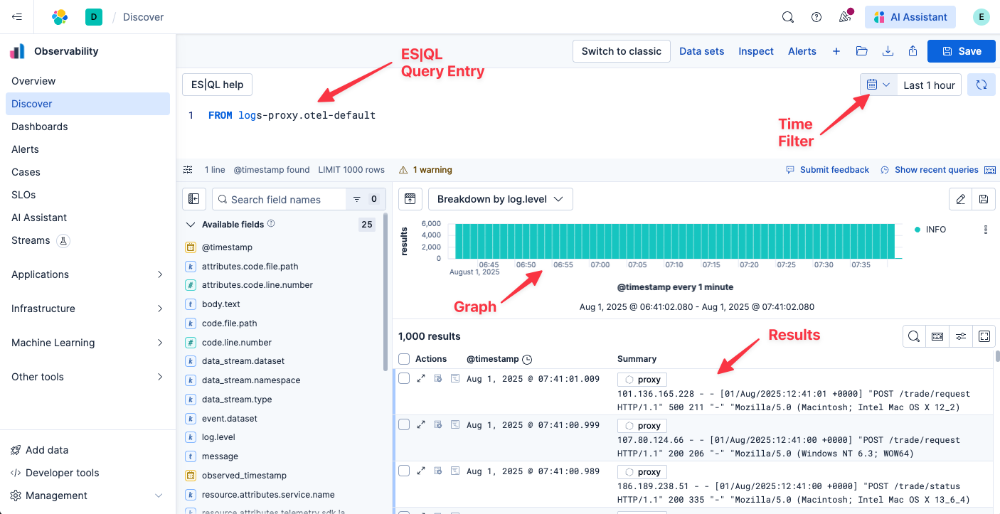

We've gotten word from our customer service department that some users are unable to complete stock trades. We know that all of the REST API calls from our front end web application flow through a nginx reverse proxy, so that seems like a good place to start our investigation.



If you are generally familiar with SQL or other piped query languages, you will be right at home with ES|QL, Elastic's modern piped query language.

You can enter your queries in the pane at the top of the Elasticsearch tab. Set the time field to the last hour, then click "Refresh" to load the results.



# Finding the errors

Let's have a look at the logs coming from our nginx reverse proxy.

Execute the following query:
```esql
FROM logs-proxy.otel-default
```

We can see that there are still transactions happening, but we don't know if they are successful or failing. Before we spend time parsing our logs, let's just quickly check for common "500" errors in our nginx logs.

Execute the following query:
```esql
FROM logs-proxy.otel-default
| WHERE MATCH(body.text, "500")
```

If we didn't find "500", we could of course add additional MATCH statements, like `OR MATCH(body.text, "404")`. We will do a better job of handling more types of errors once we start parsing our logs. For now, though, we got lucky: indeed, we are clearly returning 500 errors for some users.

# Does it affect everyone?

The next thing we quickly want to understand is what percentage of users are experiencing 500 errors.

Execute the following query:
```esql
FROM logs-proxy.otel-default
| STATS bad=COUNT() WHERE MATCH(body.text, "500"), good=COUNT() WHERE MATCH(body.text, "200") BY minute = BUCKET(@timestamp, "1 min")
```

That's good: clearly this issue is affecting only some users.

# When did it start?

Let's see if we can find when the errors started occurring. Adjust the time field to show the last 2 hours of data.

Execute the following query:
```esql
FROM logs-proxy.otel-default
| STATS bad=COUNT() WHERE MATCH(body.text, "500"), good=COUNT() WHERE MATCH(body.text, "200") BY minute = BUCKET(@timestamp, "1 min")
```

Ok, it looks like this issue first started happening around 80 minutes ago. We can use `CHANGE_POINT` to narrow it down to a specific minute:

Execute the following query:
```esql
FROM logs-proxy.otel-default
| STATS bad=COUNT() WHERE MATCH(body.text, "500"), good=COUNT() WHERE MATCH(body.text, "200") BY minute = BUCKET(@timestamp, "1 min")
| EVAL bad = COALESCE(TO_INT(bad), 0) // set bad=0 for time buckets with no bad entries
| SORT minute ASC
| CHANGE_POINT bad ON minute
| WHERE type IS NOT NULL
| KEEP type, minute, bad
```

Let's take stock of what we know:
* a small percentage of users are experiencing 500 errors
* the errors started occurring around 80 minutes ago

# Parsing with ES|QL

As you can see, simply searching for known error codes in our log lines will only get us so far. Maybe the error codes vary, or aren't specifically 500, but rather something in the 400 range?

Fortunately, nginx logs are semi-structure which makes them (relatively) easy to parse.

Some of you may be familiar with GROK expressions which provides a higher-level interface on top of regex; namely, GROK allows you define patterns. If you are well versed in GROK, you may be able to write a parsing pattern yourself for nginx logs, possibly using https://grokdebugger.com to help.

If you aren't well versed, or you don't want to spend the time, you can leverage our AI Assistant to help! Click on the AI Assistant button in the upper-right and enter the following prompt:

```
can you write an ES|QL query to parse these nginx log lines?
```

> [!NOTE]
> The output should look something like the following. Because the AI Assistant may use slightly different field names, please copy and use the following instead of what was generated to ensure consistency throughout this workshop.

```esql
FROM logs-proxy.otel-default
| GROK message "%{IPORHOST:client_ip} %{USER:ident} %{USER:auth} \\[%{HTTPDATE:timestamp}\\] \"%{WORD:http_method} %{NOTSPACE:request_path} HTTP/%{NUMBER:http_version}\" %{NUMBER:status_code} %{NUMBER:body_bytes_sent:int} \"%{DATA:referrer}\" \"%{DATA:user_agent}\""
| KEEP timestamp, client_ip, http_method, request_path, status_code, user_agent
```

Now close the flyout and execute the generated ES|QL.

# Is this affecting all APIs?

Let's make use of these parsed fields to break down status_code by request_path to see if this is affecting only a specific API?

Execute the following query:
```esql
FROM logs-proxy.otel-default
| GROK message "%{IPORHOST:client_ip} %{USER:ident} %{USER:auth} \\[%{HTTPDATE:timestamp}\\] \"%{WORD:http_method} %{NOTSPACE:request_path} HTTP/%{NUMBER:http_version}\" %{NUMBER:status_code} %{NUMBER:body_bytes_sent:int} \"%{DATA:referrer}\" \"%{DATA:user_agent}\""
| WHERE status_code IS NOT NULL
| EVAL @timestamp = DATE_PARSE("dd/MMM/yyyy:HH:mm:ss Z", timestamp)
| STATS COUNT() BY status_code, request_path
```

Ok, it seems these errors are affecting all of our APIs.

# Is this affecting all User Agents?

Ideally, we could also cross-reference against the `user_agent` field.

Execute the following query:
```esql
FROM logs-proxy.otel-default
| GROK message "%{IPORHOST:client_ip} %{USER:ident} %{USER:auth} \\[%{HTTPDATE:timestamp}\\] \"%{WORD:http_method} %{NOTSPACE:request_path} HTTP/%{NUMBER:http_version}\" %{NUMBER:status_code} %{NUMBER:body_bytes_sent:int} \"%{DATA:referrer}\" \"%{DATA:user_agent}\""
| WHERE status_code IS NOT NULL
| EVAL @timestamp = DATE_PARSE("dd/MMM/yyyy:HH:mm:ss Z", timestamp)
| WHERE TO_INT(status_code) == 500
| STATS bad = COUNT() BY user_agent
```

Unfortunately, the unparsed user_agent field is too noisy to really be useful for this kind of analysis. We could try to write a GROK expression to parse `user_agent`, but in practice, it is too complicated (it requires translation in addition to parsing). Let's put a pin in this topic and revisit it in a bit.

# A better way to query

Let's redraw the time graph we drew before, but this time using status_code instead of looking for specific error codes.

Execute the following query:
```esql
FROM logs-proxy.otel-default
| GROK message "%{IPORHOST:client_ip} %{USER:ident} %{USER:auth} \\[%{HTTPDATE:timestamp}\\] \"%{WORD:http_method} %{NOTSPACE:request_path} HTTP/%{NUMBER:http_version}\" %{NUMBER:status_code} %{NUMBER:body_bytes_sent:int} \"%{DATA:referrer}\" \"%{DATA:user_agent}\""
| WHERE status_code IS NOT NULL
| EVAL timestamp = DATE_PARSE("dd/MMM/yyyy:HH:mm:ss Z", timestamp)
| STATS status = COUNT() BY status_code, minute = BUCKET(timestamp, "1 min")
```

This is a useful graph, and you can clearly see the advantage of parsing the log line vs. simply searching for specific error codes. Here, we can just generally graph by `status_code`, and additionally split the data by, say, `request_path`.

This is a useful graph! Let's save it to a Dashboard for future use.

1. Click on the Disk icon in the upper-left of the resulting graph
2. Add to a new dashboard
3. Save the new dashboard as `Ingress Proxy`

# Setting up a simple alert

We could at this point create a simple alert to notify us whenever a `status_code` >= 400 is received:

Execute the following query:
```esql
FROM logs-proxy.otel-default
| GROK message "%{IPORHOST:client_ip} %{USER:ident} %{USER:auth} \\[%{HTTPDATE:timestamp}\\] \"%{WORD:http_method} %{NOTSPACE:request_path} HTTP/%{NUMBER:http_version}\" %{NUMBER:status_code:int} %{NUMBER:body_bytes_sent:int} \"%{DATA:referrer}\" \"%{DATA:user_agent}\""
| WHERE status_code >= 400
```

1. Click Alerts in the taskbar
2. Select `Create search threshold rule`
3. Click `Test query`
4. Leave the defaults and click `Next`
5. Click `Next` on `Actions` tab
6. Click `Create rule` on `Details` tab

In practice, this alert is too simple. We probably are okay with a small percentage of non-200 errors for any large scale infrastructure. What we really want is to alert when we violate a SLO. We will come back to this in a bit.

# Summary

Let's take stock of what we know:
* a small percentage of users are experiencing 500 errors
* the errors started occurring around 80 minutes ago
* the only error type seen is 500
* the errors occur over all APIs

And what we've done:
* Created a Dashboard showing status code over time
* Created a simple alert to let us know if we ever return non-200 error codes

