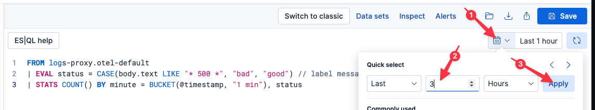

We've gotten word from our customer service department that some users are receiving an error when trying to use our web-based application. We will use this workshop to showcase Elastic's state-of-the-art logging workflow to get to the root cause of these errors.

# Ingest vs. query-time parsing

Throughout this workshop, we will be pivoting back and forth between query-time parsing using [ES|QL](https://www.elastic.co/docs/explore-analyze/query-filter/languages/esql) and ingest-time parsing using [Streams](https://www.elastic.co/docs/solutions/observability/logs/streams/streams). ES|QL lets us quickly test theories and look for possible tells in our log data. Once we've determined value in parsing our logs using ES|QL at query-time, we can shift that parsing to ingest-time using Streams. As we will see in this lab, ingest-time parsing allows for more advanced and complex workflows. Moving parsing to ingest-time also facilitates faster search results. Regardless of where the parsing is done, we will leverage ES|QL to perform aggregations, analysis, and visualization.


This workshop will heavily leverage ES|QL, Elastic's query-time language, to analyze our nginx reverse proxy logs. You can enter your queries in the pane at the top of the Elasticsearch tab. You can change the time window of your search using the Time Filter. To execute a search, click the Play/Refresh icon.


# Getting started

We know that all of the REST API calls from our frontend web app flow through a nginx reverse proxy en route to our backend services; that seems like a good place to start our investigation.


# Finding errors

Execute the following query:
```esql
FROM logs-proxy.otel-default
```

We can see that there are still transactions occurring, but we don't know if they are successful or failing. Before we spend time parsing our logs, let's just quickly search for common HTTP "500" errors in our nginx logs.

Execute the following query:
```esql
FROM logs-proxy.otel-default
| WHERE body.text LIKE "* 500 *" // look for messages containing " 500 " in the body
```

If we didn't find any 500 errors, we could of course add additional `LIKE` criteria to our `WHERE` clause, like `WHERE body.text LIKE "* 500 *" OR body.text LIKE "* 404 *"`. We will do a better job of implicitly handling more types of errors once we start parsing our logs. For now, though, we got lucky: indeed, we are clearly returning 500 errors for some users.

# Are the errors affecting all requests?

The next thing we quickly want to understand is what percentage of requests to our backend services are resulting in 500 errors?

Execute the following query:
```esql
FROM logs-proxy.otel-default
| EVAL status = CASE(body.text LIKE "* 500 *", "bad", "good") // label messages containing " 500 " as "bad", else "good"
| STATS count = COUNT() BY status // count good and bad
```

Let's visualize this as a pie graph to make it a little easier to understand.


1. Click on the pencil icon to the right of the existing graph
2. Select `Pie` from the visualizations drop-down menu
3. Click `Apply and close`

This error appears to only be affecting a percentage of our overall requests. We don't yet have the tools to break this down by customer or client, but we will in a future exercise.

# Are the errors still occurring?

Let's confirm that we are still seeing a mix of 500 and 200 errors (e.g., the problem wasn't transitory and somehow fixed itself).

Execute the following query:
```esql
FROM logs-proxy.otel-default
| EVAL status = CASE(body.text LIKE "* 500 *", "bad", "good") // label messages containing " 500 " as "bad", else "good"
| STATS COUNT() BY minute = BUCKET(@timestamp, "1 min"), status
```

Then change the resulting graph to a bar graph over time:

1. Click on the pencil icon to the right of the existing graph
2. Select `Bar` from the visualizations drop-down menu
3. Click `Apply and close`

Indeed, we are still seeing a mix of 500 and 200 errors.

# When did the errors start?

Let's see if we can find when the errors started occurring. Use the Time Filter to show the last 3 hours of data; this should automatically rerun the last query.



Ok, it looks like this issue first started happening roughly in the last 2 hours. We can use ES|QL's [CHANGE_POINT](https://www.elastic.co/docs/reference/query-languages/esql/commands/processing-commands#esql-change_point) to narrow it down to a specific minute:

Execute the following query:
```esql
FROM logs-proxy.otel-default
| EVAL status = CASE(body.text LIKE "* 500 *", "bad", "good") // label messages containing " 500 " as "bad", else "good"
| STATS count = COUNT() BY minute = BUCKET(@timestamp, "1 min"), status
| CHANGE_POINT count ON minute AS type, pval // look for distribution change
| WHERE type IS NOT NULL
| KEEP type, minute
```

A-ha! Using `CHANGE_POINT`, we can say that these errors clearly started occurring 80 minutes ago.

# Parsing logs with ES|QL

As you can see, simply searching for known error codes in our log lines will only get us so far. Maybe the error code isn't just 500, or maybe we want to analyze status code vs. request URL, for example.

Fortunately, nginx logs are semi-structured which makes them (relatively) easy to parse.

Some of you may already be familiar with [grok](https://www.elastic.co/docs/explore-analyze/scripting/grok) expressions which provides a higher-level interface on top of regex; namely, grok allows you define patterns. If you are well versed in grok, you may be able to write a parsing pattern yourself for nginx logs, possibly using tools like [Grok Debugger](https://grokdebugger.com) to help.

If you aren't well versed in grok expressions, or you don't want to spend the time to debug an expression yourself, you can leverage our AI Assistant to help!

1. Click on the AI Assistant button in the upper-right.
2. Enter the following prompt in the `Send a message to the Assistant` field at the bottom of the fly-out.
  ```
  can you write an ES|QL query to parse these nginx log lines?
  ```
3. Click the execute button


> [!NOTE]
> The output should look something like the following. Notably, the AI Assistant may generate slightly different field names on each generating. Because we rely on those field names in subsequent analysis, please close the flyout and copy and paste the following ES|QL expression into the ES|QL query entry box.

```esql
FROM logs-proxy.otel-default
| GROK body.text "%{IPORHOST:client_ip} %{USER:ident} %{USER:auth} \\[%{HTTPDATE:timestamp}\\] \"%{WORD:http_method} %{NOTSPACE:request_path} HTTP/%{NUMBER:http_version}\" %{NUMBER:status_code} %{NUMBER:body_bytes_sent:int} \"%{DATA:referrer}\" \"%{DATA:user_agent}\"" // parse access log
| WHERE status_code IS NOT NULL
| EVAL @timestamp = DATE_PARSE("dd/MMM/yyyy:HH:mm:ss Z", timestamp) // use embedded timestamp as record timestamp
| KEEP @timestamp, client_ip, http_method, request_path, status_code, user_agent
```

# Is this affecting all backend APIs?

Let's make use of these parsed fields to break down `status_code` by `request_path` to see if this is affecting only a specific API, or several APIs?

Execute the following query:
```esql
FROM logs-proxy.otel-default
| GROK body.text "%{IPORHOST:client_ip} %{USER:ident} %{USER:auth} \\[%{HTTPDATE:timestamp}\\] \"%{WORD:http_method} %{NOTSPACE:request_path} HTTP/%{NUMBER:http_version}\" %{NUMBER:status_code} %{NUMBER:body_bytes_sent:int} \"%{DATA:referrer}\" \"%{DATA:user_agent}\""
| WHERE status_code IS NOT NULL
| STATS COUNT() BY status_code, request_path
```

Ok, it seems these errors are affecting all of the APIs (2) exposed by our simple backend.

> [!NOTE]
> You may notice that our search has gotten a little slower when we added query-time grok parsing. This is because Elasticsearch is now applying our grok pattern to _every_ log line in the selected time window. In our next challenge, we will show you how we can retain fast-search over long time windows WITH parsing using ingest-time parsing!

# Is this affecting all User Agents?

Our nginx access logs also include a [User Agent](https://developer.mozilla.org/en-US/docs/Web/HTTP/Reference/Headers/User-Agent) field, which is a semi-structured field containing some information about the requesting browser. Ideally, we could also cross-reference the errors against this field to understand if it is affecting all browsers, or only some types of browsers.

Execute the following query:
```esql
FROM logs-proxy.otel-default
| GROK body.text "%{IPORHOST:client_ip} %{USER:ident} %{USER:auth} \\[%{HTTPDATE:timestamp}\\] \"%{WORD:http_method} %{NOTSPACE:request_path} HTTP/%{NUMBER:http_version}\" %{NUMBER:status_code} %{NUMBER:body_bytes_sent:int} \"%{DATA:referrer}\" \"%{DATA:user_agent}\""
| WHERE status_code IS NOT NULL
| WHERE TO_INT(status_code) == 500
| STATS bad = COUNT() BY user_agent
```

Unfortunately, the unparsed `user_agent` field is too unstructured to really be useful for this kind of analysis. We could try to write a grok expression to further parse `user_agent`, but in practice, it is too complicated (it requires translations and lookups in addition to parsing). Let's put a pin in this topic and revisit it in a bit when we have more tools at our disposal.

# Making use of our parsed fields

Let's redraw the time graph we drew before, but this time using `status_code` instead of looking for specific error codes.

Execute the following query:
```esql
FROM logs-proxy.otel-default
| GROK body.text "%{IPORHOST:client_ip} %{USER:ident} %{USER:auth} \\[%{HTTPDATE:timestamp}\\] \"%{WORD:http_method} %{NOTSPACE:request_path} HTTP/%{NUMBER:http_version}\" %{NUMBER:status_code} %{NUMBER:body_bytes_sent:int} \"%{DATA:referrer}\" \"%{DATA:user_agent}\""
| WHERE status_code IS NOT NULL
| EVAL @timestamp = DATE_PARSE("dd/MMM/yyyy:HH:mm:ss Z", timestamp)
| STATS status_count = COUNT() BY status_code, minute = BUCKET(@timestamp, "1 min")
```

> [!NOTE]
> If the resulting graph does not default to a bar graph plotted over time, click on the Pencil icon in the upper-right of the graph and change the graph type to `Bar`

Now that we are graphing by `status_code`, we know definitively that we returning only 200 and 500 status codes.

## Saving our visualization to a dashboard

Let's save this graph to a Dashboard for future use.


1. Click on the Disk icon in the upper-left of the resulting graph
2. Name the visualization
  ```
  Status Code Over Time (ESQL)
  ```
3. Select `New` under `Add to dashboard`
4. Click `Save and go to Dashboard`


You will be taken to a new dashboard. Let's save it for future reference.

1. Click the `Save` button in the upper-right
2. Enter the title of the new dashboard as
  ```
  Ingress Proxy
  ```
3. Click `Save`

# Setting up a simple alert

Go back to `Discover` using the left-hand navigation pane.

Let's create a simple alert to notify us whenever a `status_code` >= 400 is received:

Execute the following query:
```esql
FROM logs-proxy.otel-default
| GROK body.text "%{IPORHOST:client_ip} %{USER:ident} %{USER:auth} \\[%{HTTPDATE:timestamp}\\] \"%{WORD:http_method} %{NOTSPACE:request_path} HTTP/%{NUMBER:http_version}\" %{NUMBER:status_code:int} %{NUMBER:body_bytes_sent:int} \"%{DATA:referrer}\" \"%{DATA:user_agent}\""
| WHERE status_code >= 400
```


1. Click `Alerts` in the taskbar
2. Select `Create search threshold rule`
3. Click `Test query`
4. Leave the defaults and click `Next`
5. Click `Next` on `Actions` tab
6. Set `Rule name` to
  ```
  status_code >= 400
  ```
7. Set `Tags` to
  ```
  ingress
  ```
8. Click `Create rule` on `Details` tab
9. Click `Save rule` on the pop-up dialog

In practice, this alert is too simple. We probably are okay with a small percentage of non-200 errors for any large scale infrastructure. What we really want is to alert when we violate a SLO. We will revisit this topic in a bit.

# Summary

Let's take stock of what we know:

* a percentage of requests are experiencing 500 errors
* the errors started occurring around 80 minutes ago
* the only error type seen is 500
* the errors occur over all APIs

And what we've done:

* Created a Dashboard to monitor our ingress proxy
* Created a simple alert to let us know if we ever return non-200 error codes

