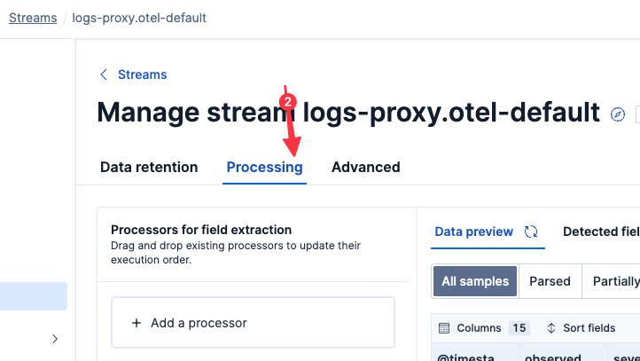
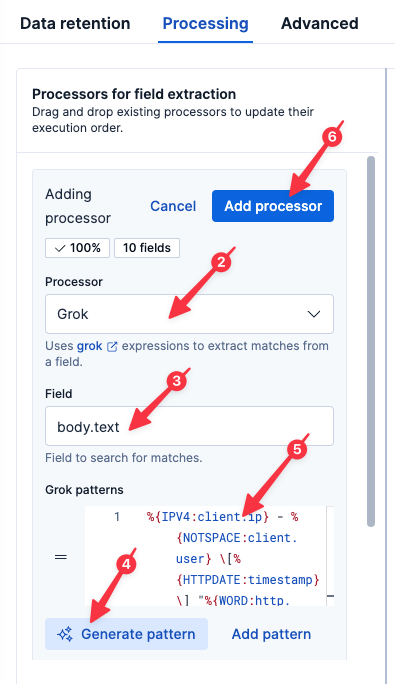
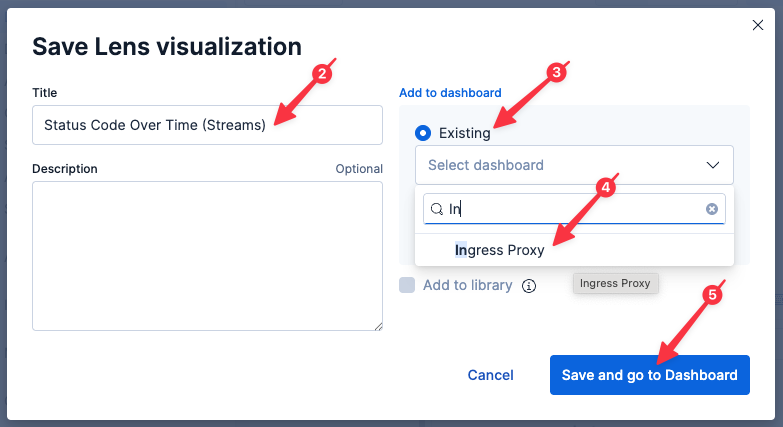
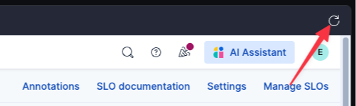
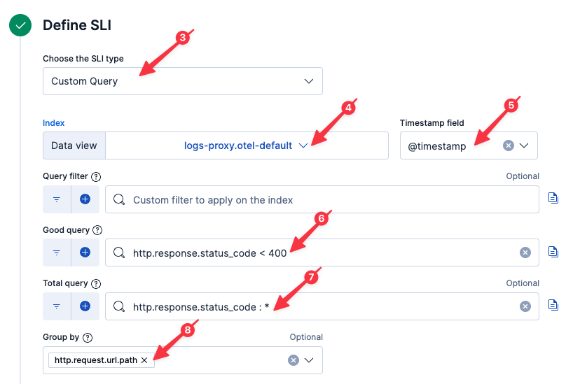
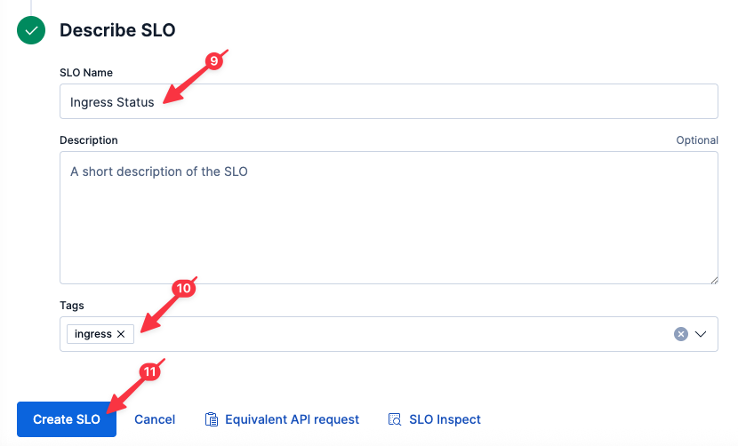
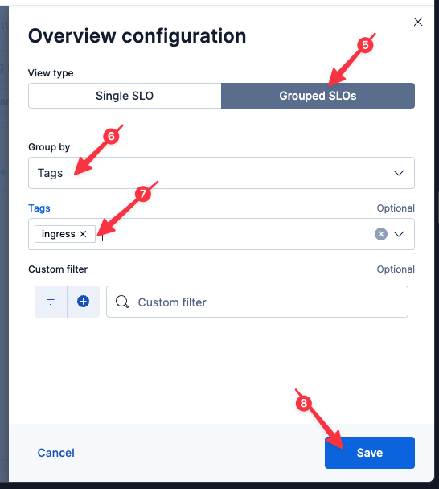

So far, we've been using ES|QL to parse our proxy logs at query time. While incredibly powerful for quick analysis, we can do even more with our logs if we parse them at ingest-time.

# Parsing with Streams

We will be working with the Elastic [Streams](https://www.elastic.co/docs/solutions/observability/logs/streams/streams) interface which makes it easy to setup log parsing pipelines.

1. Select `logs-proxy.otel-default` from the list of data streams (if you start typing, Elasticsearch will help you find it)
2. Select the `Processing` tab



## Parsing the log message

We can parse our nginx log messages at ingest-time using the Elastic [Grok](https://www.elastic.co/docs/reference/enrich-processor/grok-processor) processor.

1. Click `Add a processor`
2. Select the `Grok` Processor (if not already selected)
3. Set the `Field` to
  ```
  body.text
  ```
4. Click `Generate pattern`. Elasticsearch will analyze your log lines and try to determine a suitable grok pattern.
5. To ensure a consistent lab experience, copy the following grok expression and paste it into the `Grok patterns` field (rather than clicking on the `Accept` button)
```
%{IPV4:client.ip} - %{NOTSPACE:client.user} \[%{HTTPDATE:timestamp}\] "%{WORD:http.request.method} %{URIPATH:http.request.url.path} HTTP/%{NUMBER:http.version}" %{NUMBER:http.response.status_code:int} %{NUMBER:http.response.body.bytes:int} "%{DATA:http.request.referrer}" "%{GREEDYDATA:user_agent.original}"
```
6. Click `Add processor`



## Parsing the timestamp

The nginx log line includes a timestamp; let's use that as our record timestamp.

1. Click `Add a processor`
2. Select `Date`
3. Set `Field` to `timestamp`
4. Elastic should auto-recognize the format: `dd/MMM/yyyy:HH:mm:ss XX`
5. Click `Add processor`


Now save the Processing by clicking `Save changes` in the bottom-right.

# A faster way to query

Now let's jump back to Discover by clicking `Discover` in the left-hand navigation pane.

Execute the following query:
```esql
FROM logs-proxy.otel-default
| WHERE http.response.status_code IS NOT NULL
| KEEP @timestamp, client.ip, http.request.method, http.request.url.path, http.response.status_code, user_agent.original
```

> [!NOTE]
> If you get back `1,000 results` but the resulting columns are empty, remove the `Selected fields` (by clicking the `X` next to each), and then add each `Available field` (by clicking the `+` next to each).

Let's redraw our status code graph using our newly parsed field:

Execute the following query:
```
FROM logs-proxy.otel-default
| WHERE http.response.status_code IS NOT NULL
| STATS COUNT() BY TO_STRING(http.response.status_code), minute = BUCKET(@timestamp, "1 min")
```

Note that this graph, unlike the one we drew before, currently shows only a few minutes of data. That is because it relies upon the fields we parsed in the Processing we just setup. Prior to that time, those fields didn't exist. Change the time field to `Last 5 Minutes` to zoom in on the newly parsed data.

## Saving our visualization to a dashboard

This is a useful graph! Let's save it to our Dashboard for future use.

1. Click on the Disk icon in the upper-left of the resulting graph
2. Name the visualization
  ```
  Status Code Over Time (Streams)
  ```
3. Select `Existing` under `Add to dashboard`
4. Select the existing dashboard `Ingress Proxy` (you will need to start typing `Ingress` in the `Search dashboards...` field)
5. Click `Save and go to Dashboard`
6. Once the dashboard has loaded, click the `Save` button in the upper-right



# Creating a SLO

> [!NOTE]
> Because we are moving quickly, Elasticsearch may take some time to update field lists in the UI. If you encounter a situation where Elasticsearch doesn't recognize one of the fields we just parsed, click the Refresh icon in the upper-right of the Instruqt tab and try again to create the SLO.



Remember that simple alert we created? Now that we are parsing these fields at ingest-time, we can create a proper SLO instead of a simple binary alert. With a SLO, we can allow for some percentage of errors over time (common in a complex system) before we get our support staff out of bed.

1. Click `SLOs` in the left-hand navigation pane
2. Click `Create SLO`
3. Select `Custom Query` (if not already selected)
4. Set `Data view` to `logs-proxy.otel-default`
5. Set `Timestamp field` to `@timestamp` (if not already selected)
6. Set `Good query` to
  ```
  http.response.status_code < 400
  ```
7. Set `Total query` to
  ```
  http.response.status_code : *
  ```
8. Set `Group by` to
  ```
  http.request.url.path
  ```



9. Set `SLO Name` to
  ```
  Ingress Status
  ```
10. Set `Tags` to
  ```
  ingress
  ```
11. Click `Create SLO`



## Alerting on a SLO

Now let's setup an alert that triggers when this SLO is breached.

1. Click on your newly created SLO `Ingress Status`
2. Under the `Actions` menu in the upper-right, select `Manage burn rate rule`

With burn rates, we can have Elastic dynamically adjust the escalation of a potential issue depending on how quickly it appears we will breach our SLO.

3. On the `Details` tab of the fly-out, set the `Rule name` to :
  ```
  Ingress Status SLO
  ```
4. Set `Tags` to
  ```
  ingress
  ```
5. Click `Save changes`
6. Click `Save rule` on the pop-up dialog

## Adding SLO monitors to our dashboard

Now let's add the SLO monitor to our dashboard to help us find it in the future.

1. Click `Dashboards` in the left-hand navigation pane
2. Open the `Ingress Status` dashboard (if not already open)
3. Click `Add panel`
4. Select `SLO Overview`
5. Select `Grouped SLOs`
6. Set `Group by` to `Tags`
7. Set `Tags` to `ingress`
8. Click `Save`



Note that we are dynamically adding SLOs by tag. Any additional SLOs tagged with `ingress` will also appear here.

## Adding alerts to our dashboard

Let's also add our growing list of Alerts to our Dashboard.

1. Click `Add panel`
2. Select `Alerts`
4. Set `Filter by` to `Rule tags`
5. Set `Rule tags` to `ingress`
6. Click `Save`

Note that we are dynamically adding alerts by tag. Any additional alerts tagged with `ingress` will also appear here.

Now save the changes to our dashboard by clicking the `Save` button in the upper-right.

# Summary

Let's take stock of what we know:

* a small percentage of requests are experiencing 500 errors
* the errors started occurring around 80 minutes ago
* the only error type seen is 500
* the errors occur over all APIs

And what we've done:

* Created a Dashboard to monitor our ingress proxy
* Created a simple alert to let us know if we ever return non-200 error codes
* Parsed the logs at ingest-time for quicker and more powerful analysis
* Create a SLO (with alert) to let us know if we ever return a significant number of non-200 error codes over time
