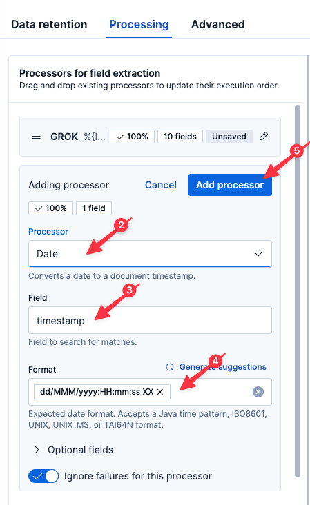

So far, we've been using ES|QL to parse our proxy logs at query time. While incredibly powerful for quick analysis, we can do even more with our logs if we parse them at ingest-time.

# Parsing with Streams

We will be working with the Elastic Streams interface which makes it easy to setup log parsing pipelines.

1. Select `logs-proxy.otel-default` from the list of data streams
2. Select the `Processing` tab
3. Click `Add a processor`
4. Select `Grok` for the `Processor` if not already selected
5. Set the `Field` to `body.text` if not already filled in
6. Click `Generate pattern`

Elastic will analyze your log lines and try to recognize a pattern.

The generated pattern should look similar to the following.

> [!NOTE]
> To ensure a consistent lab experience, please copy the following GROK expression and paste it into `Grok patterns`

```
%{IPV4:client.ip} - %{NOTSPACE:client.user} \[%{HTTPDATE:timestamp}\] "%{WORD:http.request.method} %{URIPATH:http.request.url.path} HTTP/%{NUMBER:http.version}" %{NUMBER:http.response.status_code:int} %{NUMBER:http.response.body.bytes:int} "%{DATA:http.request.referrer}" "%{GREEDYDATA:user_agent.original}"
```

7. Click `Accept`
8. Click `Add processor`


The nginx log line includes a timestamp; let's use that as our record timestamp.

1. Click `Add a processor`
2. Select `Date`
3. Set `Field` to `timestamp`
4. Elastic should auto-recognize the format: `dd/MMM/yyyy:HH:mm:ss XX`
5. Click `Add processor`



Now save the Processing by clicking `Save changes`.

# A faster way to query

Now let's jump back to Discover by clicking Discover in the left-hand navigation pane.

Execute the following query:
```esql
FROM logs-proxy.otel-default
| WHERE http.response.status_code IS NOT NULL
| KEEP @timestamp, client.ip, http.request.method, http.request.url.path, http.response.status_code, user_agent.original
```

Let's redraw our status code graph using our newly parsed field:

Execute the following query:
```
FROM logs-proxy.otel-default
| WHERE http.response.status_code IS NOT NULL
| STATS COUNT() BY TO_STRING(http.response.status_code), minute = BUCKET(@timestamp, "1 min")
```

Note that this graph, unlike the one we drew before, only has a few minutes of data. That is because it relies upon the fields we parsed in the Processing we just setup. Prior to that time, those fields didn't exist. Change the time field to `Last 15 Minutes` to see newly parsed data.

You'll also note how quickly this graph rendered compared to when we were parsing our log lines at query-time with ES|QL.

This is a useful graph! Let's save it to our Dashboard for future use.

1. Click on the Disk icon in the upper-left of the resulting graph
2. Name the visualization
  ```
  Status Code Over Time (Streams)
  ```
3. Select `Existing` under `Add to dashboard`
4. Select the existing dashboard `Ingress Proxy`
4. Click `Save and go to Dashboard`
5. Once the dashboard has loaded, click the `Save` button in the upper-right

# Creating a SLO

Remember that simple alert we created? Now that we are parsing these fields at ingest-time, we can create a proper SLO instead of a simple binary alert. With a SLO, we can allow for some percentage of errors over time (common in a complex system) before we get our support staff out of bed.

1. Click `SLOs` in the left-hand navigation
2. Click `Create SLO`
3. Select `Custom Query`
4. Set `Data view` to `logs-proxy.otel-default`
5. Set `Timestamp field` to `@timestamp`
6. Set `Good query` to `http.response.status_code : 200`  (if this field isn't available, refresh the Instruqt virtual browser tab)
7. Set `Total query` to `http.response.status_code : *` (if this field isn't available, refresh the Instruqt virtual browser tab)
8. Set `Group by` to `http.request.url.path` (if this field isn't available, refresh the Instruqt virtual browser tab)
9. Set `Duration` to `7 days`
10. Set `Target / SLO (%)` to `99.999`
11. Set `SLO Name` to `Ingress Status`
12. Click `Create SLO`
13. Click on your newly created SLO `Ingress Status`
14. Under the `Actions` menu in the upper-right, select `Create new alert rule`

With burn rates, we can have Elastic dynamically adjust the escalation of a potential issue depending on how quickly it appears we will breach our SLO.

13. Click `Next`
14. (here we could create an action to take when our SLO starts to degrade, like posting to a Slack channel, creating a ServiceNow ticket, or connecting to Pager Duty)
15. Click `Next`
16. Click `Create rule`

> [!NOTE]
> Because we are moving quickly, Elasticsearch may take some time to update field lists in the UI. If you encounter a situation where Elasticsearch doesn't recognize one of the fields we just parsed, click the Refresh icon in the upper-right of the Instruqt tab and try again to create the SLO. 

# Summary

Let's take stock of what we know:

* a small percentage of users are experiencing 500 errors
* the errors started occurring around 80 minutes ago
* the only error type seen is 500
* the errors occur over all APIs

And what we've done:

* Created a Dashboard showing status code over time
* Created a simple alert to let us know if we ever return non-200 error codes
* Parsed the logs for quicker and more powerful analysis
* Create a SLO to let us know if we ever return non-200 error codes over time
