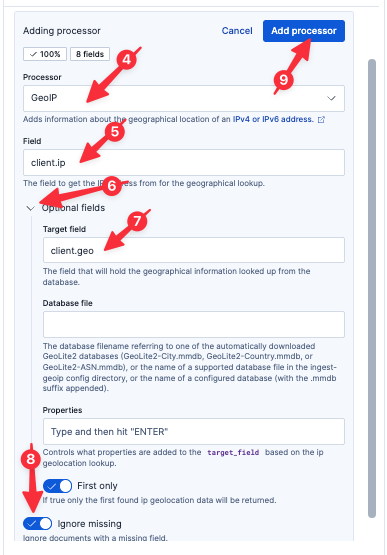

We still don't know why some requests are failing. Now that we are parsing the logs, however, we have access to a lot more information.

# Is this affecting every region?

Let's analyze our clients by `client.ip` to look for possibly geographic patterns.

## Adding the GeoIP processor

We can add the Elastic [GeoIP](https://www.elastic.co/docs/reference/enrich-processor/geoip-processor) processor to geo-locate our clients based on their client IP address.

1. Select `logs-proxy.otel-default` from the list of Streams.
2. Select the `Processing` tab
3. Click `Add a processor`
4. Select the `GeoIP` Processor
5. Set the `Field` to
  ```
  client.ip
  ```
6. Open `Optional fields`
7. Set `Target field` to
  ```
  client.geo
  ```
8. Set `Ignore missing` to true
9. Click `Add processor`
10. Click `Save changes` in the bottom-right



## Analyzing with Discover

Jump back to Discover by clicking `Discover` in the left-hand navigation pane.

Adjust the time field to show the last 3 hours of data.

Execute the following query:
```esql
FROM logs-proxy.otel-default
| WHERE client.geo.country_iso_code IS NOT NULL AND http.response.status_code IS NOT NULL
| STATS COUNT() BY http.response.status_code, client.geo.country_iso_code
| SORT http.response.status_code DESC
```

Let's make this a pie chart to allow for more intuitive visualization.

1. Click the pencil icon to the right of the graph
2. Select `Pie` from the dropdown menu
3. Click `Apply and close`

Wow! It looks like all of our 500 errors are occurring in the `TH` (Thailand) region. That is really interesting; without more information, we might be tempted to stop our RCA analysis here. However, there is often more to the story, as we will see.

### Saving our visualization to a dashboard

In the meantime, this is a useful graph! Let's save it to a Dashboard for future use.

1. Click on the Disk icon in the upper-left of the resulting graph
2. Name the visualization
  ```
  Status by Region
  ```
3. Select `Existing` under `Add to dashboard`
4. Select the existing dashboard `Ingress Proxy` (you will need to start typing `Ingress` in the `Search dashboards...` field)
4. Click `Save and go to Dashboard`
5. Once the dashboard has loaded, click the `Save` button in the upper-right

## Visualizing with Maps

> [!NOTE]
> Because we are moving quickly, Elasticsearch may take some time to update field lists in the UI. If you encounter a situation where Elasticsearch doesn't recognize one of the fields we just parsed, click the Refresh icon in the upper-right of the Instruqt tab and try again to create the Map.

Sometimes it is helpful to visualize geography on a map. Fortunately, Elastic has a built-in Map visualization we can readily use!

1. Go to `Other tools` > `Maps` using the left-hand navigation pane
2. Click `Add layer`
3. Select `Documents`
4. Select `Data view` to `logs-proxy.otel-default`
5. Set `Geospatial field` to `client.geo.location` (if this field isn't available, refresh the Instruqt virtual browser tab)
6. Click `Add and continue`
7. Scroll down to `Layer style`
8. Set `Fill color` to `By value`
9. Set `Select a field` to `http.response.status_code`
10. Set `As number` to `As category`
11. Set `Symbol Size` to `By value`
12. Set `Select a field` to `http.response.status_code`
13. Click `Keep changes`

Feel free to scroll around on our globe.

### Saving our map to a dashboard

Now let's save our awesome map to our dashboard.

1. Click the `Save` button in the upper-right
2. Set `Title` to
  ```
  Status Code by Location
  ```
3. Select existing dashboard `Ingress Status` (you will need to start typing `Ingress` in the `Search dashboards...` field)
4. Click `Save and go to dashboard`

# Organizing our dashboard

As we are adding panels to our dashboard, we can group them into collapsible sections.

1. Click on `Add panel`
2. Select `Collapsible Section`
3. Click on the Pencil icon to the right of the name of the new collapsible section
4. Name the collapsible section
  ```
  Client Geography
  ```
5. Click the green check box next to the name of the collapsible section
6. Open the collapsible section (if it isn't already) by clicking on the open/close arrow to the left of the collapsible section name
7. Drag the `Status by Region` pie chart and the `Status Code by Location` map into the body below the `Client Geography` collapsible section

Now save the dashboard by clicking on the `Save` button in the upper-right.

# Summary

Let's take stock of what we know:

* a small percentage of requests are experiencing 500 errors
* the errors started occurring around 80 minutes ago
* the only error type seen is 500
* the errors occur over all APIs
* the errors occur only in the `TH` (Thailand) region

And what we've done:

* Created a Dashboard to monitor our ingress proxy
* Created a simple alert to let us know if we ever return non-200 error codes
* Parsed the logs at ingest-time for quicker and more powerful analysis
* Create a SLO (with alert) to let us know if we ever return a significant number of non-200 error codes over time
* Created a Map to help us visually geo-locate the errors
