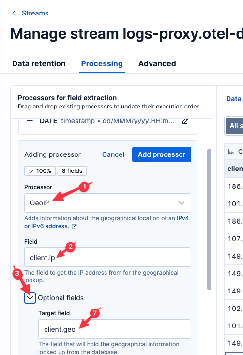
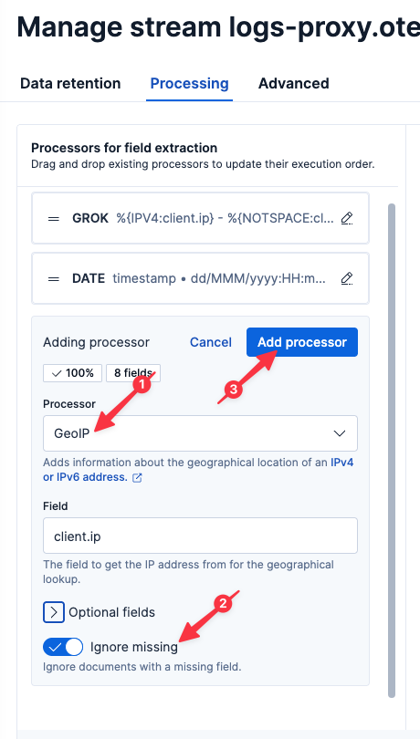

We still don't know why some requests are failing. Now that we are parsing the logs, however, we have access to a lot more information.

# Is this affecting every region?
Let's analyze our clients by `client.ip` to look for possibly geographic patterns. We can easily do that with the Elastic `GeoIP` processor.

1. Select `logs-proxy.otel-default` from the list of Streams.
2. Select the `Processing` tab
3. Click `Add a processor`
4. Select `GeoIP`
5. Set the `Field` to
  ```
  client.ip
  ```
6. Open `Optional fields` and set `Target field` to
  ```
  client.geo
  ```
7. Set `Ignore missing` to true
8. Click `Add processor`
9. Click `Save changes`




Let's jump back to Discover by clicking Discover in the left-hand navigation pane.

Execute the following query:
```esql
FROM logs-proxy.otel-default
| WHERE client.geo.country_iso_code IS NOT NULL AND http.response.status_code IS NOT NULL
| STATS COUNT() BY http.response.status_code, client.geo.country_iso_code
```

Let's make this a pie chart to allow for more intuitive visualization.

1. Click the pencil icon to the right of the graph
2. Select `Pie` from the dropdown menu

So it looks like all of our 500 errors are contained in the `TW` (Taiwon) region. That is interesting, and without more information, we might be tempted to stop our RCA analysis here. There is always more to the story, as you will see.

In the meantime, this is a useful graph! Let's save it to a Dashboard for future use.

1. Click on the Disk icon in the upper-left of the resulting graph
2. Name the visualization
  ```
  Status by Region
  ```
3. Select `Existing` under `Add to dashboard`
4. Select the existing dashboard `Ingress Proxy`
4. Click `Save and go to Dashboard`
5. Once the dashboard has loaded, click the `Save` button in the upper-right

# Visualizing with Maps

Sometimes it is helpful to visualize geography on a map. Fortunately, Elastic has a built-in Map visualization we can readily use!

1. Navigate to `Other tools` > `Maps`
2. Click `Add layer`
3. Select `Elasticsearch`
4. Select `Documents`
5. Select `Data view` to `logs-proxy.otel-default`
6. Set `Geospatial field` to `client.geo.location` (if this field isn't available, refresh the Instruqt virtual browser tab)
7. Click `Add and continue`
8. Scroll down to `Layer style`
9. Set `Fill color` to `By value`
10. Set `Select a field` to `http.response.status_code`
11. Set `As number` to `As category`
12. Set `Symbol Size` to `By value`
12. Set `Select a field` to `http.response.status_code`
13. Click `Keep changes`
14. Click `Save`
15. Name the Map
  ```
  Status Code by Location
  ```
15. Select existing dashboard `Ingress Status`
16. Click `Save and go to dashboard`
17. Once the dashboard has loaded, click the `Save` button in the upper-right

# Summary

Let's take stock of what we know:

* a small percentage of users are experiencing 500 errors
* the errors started occurring around 80 minutes ago
* the only error type seen is 500
* the errors occur over all APIs
* the errors occur only in the `TW` region

And what we've done:

* Created a Dashboard showing status code over time
* Created a simple alert to let us know if we ever return non-200 error codes
* Parsed the logs for quicker and more powerful analysis
* Create a SLO to let us know if we ever return non-200 error codes over time
* Created a Map to help us visually geo-locate the errors
