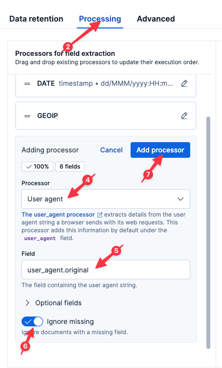
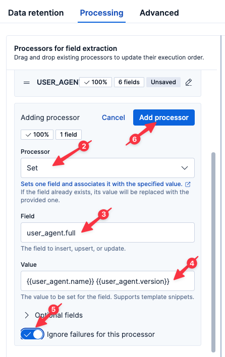

We know that errors appear to be localized to a specific region. But maybe there is more to the story?

# Is this affecting every browser type?

Let's parse that User Agent string to look for correlation. While difficult/impossible with a simple GROK expression, you can easily do this with the Elastic `User agent` processor.

1. Select `logs-proxy.otel-default` from the list of Streams.
2. Select the `Processing` tab
3. Click `Add a processor`
4. Select `User agent`
5. Set the `Field` to
  ```
  user_agent.original
  ```
6. Set `Ignore missing` to true
7. Click `Add processor`



In addition to the fields produced by the User Agent processor, we also want a simplified combination of browser name and version. We can easily craft one using the Set processor.

1. Click `Add a processor`
2. Click `Set`
3. Set `Field` to
  ```
  user_agent.full
  ```
4. Set `Value` to
  ```
  {{user_agent.name}} {{user_agent.version}}
  ```
5. Click `Ignore failures for this processor`
6. Click `Add processor`
7. Click `Save changes`



Now let's jump back to Discover by clicking Discover in the left-hand navigation pane.

Execute the following query:
```esql
FROM logs-proxy.otel-default
| WHERE user_agent.full IS NOT NULL
| STATS good = COUNT(http.response.status_code < 400 OR NULL), bad = COUNT(http.response.status_code >= 500 OR NULL) BY user_agent.full
| SORT bad DESC
```

Ah-ha, there is more to the story! It appears our errors may be isolated to a specific browser version. Let's break this down by `user_agent.version`.

```esql
FROM logs-proxy.otel-default
| WHERE user_agent.full IS NOT NULL
| STATS good = COUNT(http.response.status_code < 400 OR NULL), bad = COUNT(http.response.status_code >= 500 OR NULL) BY user_agent.version
| SORT bad DESC
```

Indeed, it appears we might have a problem with version 136 of the Chrome browser!

# Correlating with region

So what's the correlation with the geographic area we previously saw?

Execute the following query:
```esql
FROM logs-proxy.otel-default
| WHERE client.geo.country_iso_code IS NOT NULL AND user_agent.version IS NOT NULL AND http.response.status_code IS NOT NULL
| EVAL version_major = SUBSTRING(user_agent.version,0,LOCATE(user_agent.version, ".")-1)
| WHERE user_agent.name == "Chrome"
| WHERE TO_INT(version_major) == 136
| STATS COUNT() BY client.geo.country_iso_code
```

Ah! It appears that this specific version of the Chrome browser has only been seen in the `TH` region! Quite possibly, Google has rolled out a specialized or canary version of their browser first in the `TH` region.

Congratulations! We found our problem! In the next challenge, we will setup a way to catch new User Agents in the future.

# Summary

Let's take stock of what we know:

* a small percentage of users are experiencing 500 errors
* the errors started occurring around 80 minutes ago
* the only error type seen is 500
* the errors occur over all APIs
* the errors occur only in the `TH` region
* the errors occur only with browsers based on Chrome v136

And what we've done:

* Created a Dashboard showing ingress status
* Created a simple alert to let us know if we ever return non-200 error codes
* Parsed the logs for quicker and more powerful analysis
* Create a SLO to let us know if we ever return non-200 error codes over time
* Created a Map to help us visually geo-locate the errors
