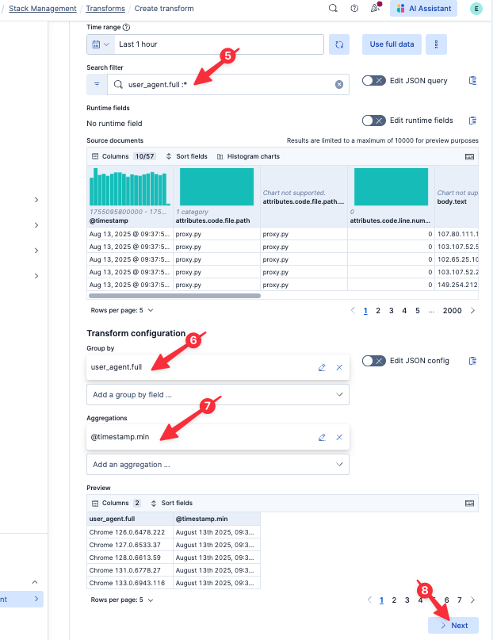
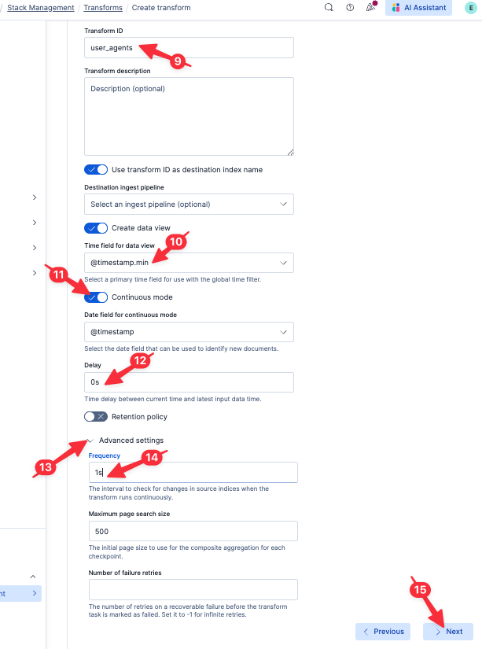
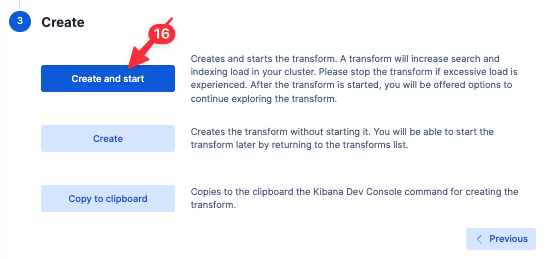
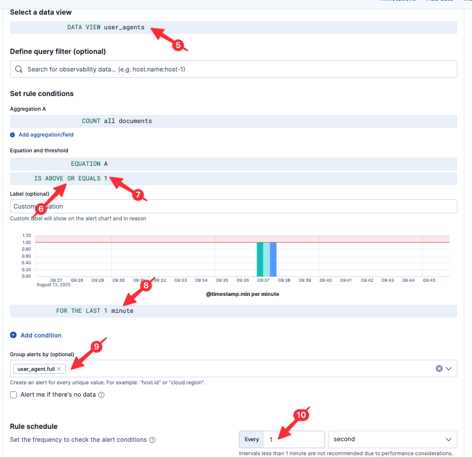
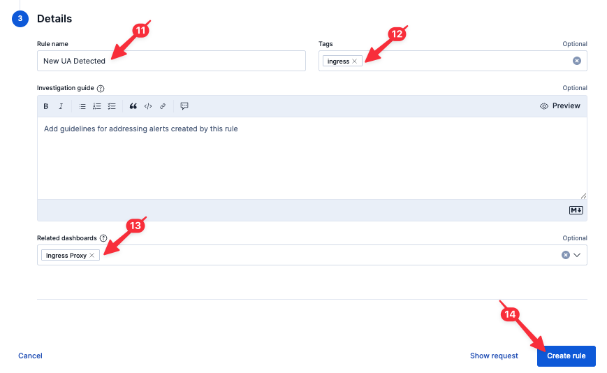

Now that we know what happened, let's try to be sure this never happens again by building out more reporting and alerting.

# Generating a breakdown of user agents

As long as we are parsing our User Agent string, let's build some visualizations of the makeup of our browser clients. We can accomplish this using our parsed User Agent string and ES|QL.

## Breakdown by OS

Execute the following query:
```esql
FROM logs-proxy.otel-default
| WHERE user_agent.os.name IS NOT NULL
| STATS COUNT() by user_agent.os.name, user_agent.os.version
```

1. Click on the pencil icon to the right of the existing graph
2. Select `Treemap` from the visualizations drop-down menu
3. Click `Apply and close`

## Saving our visualization to a dashboard

Let's save it to our dashboard for future use.

1. Click on the Disk icon in the upper-left of the resulting graph
2. Name the visualization
  ```
  Client OSs
  ```
3. Select `Existing` under `Add to dashboard`
4. Select the existing dashboard `Ingress Proxy` (you will need to start typing `Ingress` in the `Search dashboards...` field)
5. Click `Save and go to Dashboard`
6. Once the dashboard has loaded, click the `Save` button in the upper-right

## Breakdown by Browser

Let's also create a chart depicting the overall breakdown of browsers.

Jump back to Discover by clicking `Discover` in the left-hand navigation pane.

Execute the following query:
```esql
FROM logs-proxy.otel-default
| WHERE user_agent.name IS NOT NULL
| STATS COUNT() by user_agent.name
```

1. Click on the pencil icon to the right of the existing graph
2. Select `Pie` from the visualizations drop-down menu
3. Click `Apply and close`

## Adding our visualization to a dashboard

Let's save it to our dashboard for future use.

1. Click on the Disk icon in the upper-left of the resulting graph
2. Name the visualization
  ```
  Client Browsers
  ```
3. Select `Existing` under `Add to dashboard`
4. Select the existing dashboard `Ingress Proxy` (you will need to start typing `Ingress` in the `Search dashboards...` field)
5. Click `Save and go to Dashboard`
6. Once the dashboard has loaded, click the `Save` button in the upper-right

# Generating a table of user agents

It would also be helpful is to keep track of new User Agents as they appear in the wild.

Jump back to Discover by clicking `Discover` in the left-hand navigation pane.

Execute the following query:
```esql
FROM logs-proxy.otel-default
| WHERE user_agent.full IS NOT NULL
| STATS @timestamp.min = MIN(@timestamp), @timestamp.max = MAX(@timestamp) BY user_agent.full
```

This is good, but it would also be helpful, based on our experience here, to know the first country that a given User Agent appeared in.

Execute the following query:
```esql
FROM logs-proxy.otel-default
| WHERE user_agent.full IS NOT NULL
| STATS @timestamp.min = MIN(@timestamp), @timestamp.max = MAX(@timestamp) BY user_agent.full, client.geo.country_iso_code
| SORT @timestamp.min ASC // sort first seen to last seen
| STATS first_country_iso_code = TOP(client.geo.country_iso_code , 1, "asc"), first_seen = MIN(@timestamp.min), last_seen = MAX(@timestamp.max) BY user_agent.full // select first and last seen values
| SORT user_agent.full, first_seen, last_seen, first_country_iso_code
```

Fabulous! Now we can see every User Agent we encounter, when we first encountered it, and in what region it was first seen.

## Using LOOKUP JOIN to determine release date

Say you also wanted to know when a given User Agent was released to the wild by the developer?

We could try to maintain our own User Agent lookup table and use ES|QL [LOOKUP JOIN](https://www.elastic.co/docs/reference/query-languages/esql/commands/processing-commands#esql-lookup-join) to match browser versions to release dates:

Execute the following query:
```esql
FROM ua_lookup
```

We built this table by hand; it is far from comprehensive. Now let's use `LOOKUP JOIN` to do a real-time lookup for each row:

Execute the following query:
```esql
FROM logs-proxy.otel-default
| WHERE user_agent.full IS NOT NULL
| EVAL user_agent.name_and_vmajor = SUBSTRING(user_agent.full, 0, LOCATE(user_agent.full, ".")-1) // simplify user_agent
| STATS @timestamp.min = MIN(@timestamp), @timestamp.max = MAX(@timestamp) BY user_agent.name_and_vmajor, client.geo.country_iso_code
| SORT @timestamp.min ASC // sort first seen to last seen
| STATS first_country_iso_code = TOP(client.geo.country_iso_code , 1, "asc"), first_seen = MIN(@timestamp.min), last_seen = MAX(@timestamp.max) BY user_agent.name_and_vmajor // select first and last seen values
| SORT user_agent.name_and_vmajor, first_seen, last_seen, first_country_iso_code
| LOOKUP JOIN ua_lookup ON user_agent.name_and_vmajor // lookup release_date from ua_lookup using user_agent.name_and_vmajor key
| KEEP release_date, user_agent.name_and_vmajor, first_country_iso_code, first_seen, last_seen
```

We can quickly see the problem with maintaining our own `ua_lookup` index. It would take a lot of work to truly track the release date of every Browser version in the wild.

## Using COMPLETION to determine release date

Fortunately, Elastic makes it possible to leverage an external Large Language Model (LLM) as part of an ES|QL query using the [COMPLETION](https://www.elastic.co/docs/reference/query-languages/esql/commands/processing-commands#esql-completion) command. In this case, we can pipe each browser to the LLM and ask it to return the release date.

Execute the following query:
```esql
FROM logs-proxy.otel-default
| WHERE user_agent.full IS NOT NULL
| STATS @timestamp.min = MIN(@timestamp), @timestamp.max = MAX(@timestamp) BY user_agent.full, client.geo.country_iso_code
| SORT @timestamp.min ASC // sort first seen to last seen
| STATS first_country_iso_code = TOP(client.geo.country_iso_code , 1, "asc"), first_seen = MIN(@timestamp.min), last_seen = MAX(@timestamp.max) BY user_agent.full
| SORT first_seen DESC
| LIMIT 10 // intentionally limit to top 10 first_seen to limit LLM completions
| EVAL prompt = CONCAT(
   "when did this version of this browser come out? output only a version of the format mm/dd/yyyy",
   "browser: ", user_agent.full
  ) | COMPLETION release_date = prompt WITH openai_completion // call out to LLM for each record
| EVAL release_date = DATE_PARSE("MM/dd/YYYY", release_date)
| KEEP release_date, first_country_iso_code, user_agent.full, first_seen, last_seen
```

> [!NOTE]
> If this encounters a timeout, try executing the query again.

You'll note that we are limiting our results to only the top 10 last seen User Agents. This is intentional to limit the number of `COMPLETION` commands executed, as each one will result in a call to our configured external Large Language Model (LLM). Notably, the use of the `COMPLETION` command is in Tech Preview; future revisions of ES|QL may include a means to more practically scale the use of the `COMPLETION` command.

Let's save this search for future reference:

1. Click the `Save` button in the upper-right
2. Set `Title` to
  ```
  ua_release_dates
  ```
3. Click `Save`

Saving an ES|QL query allows others on our team to easily re-run it on demand. By saving the query, we can also add it to our dashboard!

## Adding our table to a dashboard

1. Click `Dashboards` in the left-hand navigation pane
2. Open the `Ingress Status` dashboard (if it isn't already open)
3. Click `Add from library`
4. Find and select `ua_release_dates`
5. Close the fly-out
6. Click `Save` to save the dashboard

# Organizing our dashboard

As we are adding panels to our dashboard, we can group them into collapsible sections.

1. Click on `Add panel`
2. Select `Collapsible Section`
3. Click on the Pencil icon to the right of the name of the new collapsible section
4. Name the collapsible section
  ```
  User Agent
  ```
5. Click the green check box next to the name of the collapsible section
6. Open the collapsible section (if it isn't already) by clicking on the open/close arrow to the left of the collapsible section name
7. Drag the `ua_release_dates` table, the `Client Browsers` pie chart, and the `Client OSs` treemap into the body below the `User Agent` collapsible section
8. Click `Save` to save the dashboard

Feel free to create additional collapsible sections to group and organize other visualizations on our dashboard.

# Scheduling a report

The CIO is concerned about us not testing new browsers sufficiently, and for some time wants a nightly report of our dashboard. No problem!

1. Click on `Export` icon
2. Select `Schedule exports`
3. Click `Schedule exports` at the bottom-right of the resulting fly-out


# Alert when a new UA is seen

Ideally, we can send an alert whenever a new User Agent is seen. To do that, we need to keep state of what User Agents we've already seen. Fortunately, Elastic [Transforms](https://www.elastic.co/docs/explore-analyze/transforms) makes this easy!

Transforms run asynchronously in the background, querying data, aggregating it, and writing the results to a new index. In this case, we can use a Pivot transform to read from our parsed proxy logs and pivot based on `user_agent.full`. This will create a new index with one record per `user_agent.full`. We can then alert whenever a new record is added to this index, indicating a new User Agent!

## Creating a transform

> [!NOTE]
> Because we are moving quickly, Elasticsearch may take some time to update field lists in the UI. If you encounter a situation where Elasticsearch doesn't recognize one of the fields we just parsed, click the Refresh icon in the upper-right of the Instruqt tab and try again to create the Transform.

1. Go to `Management` > `Stack Management` > `Transforms` using the left-hand navigation pane
2. Click `Create your first transform`
3. Select `logs-proxy.otel-default`
4. Select `Pivot` (if not already selected)
5. Set `Search filter` to
  ```
  user_agent.full :*
  ```
6. Set `Group by` to `terms(user_agent.full)`
7. Add an aggregation for `@timestamp.min`
8. Click `> Next`



9. Set the `Transform ID` to
  ```
  user_agents
  ```
10. Set `Time field` to `@timestamp.min` (if not already selected)
11. Set `Continuous mode` on
12. Set `Delay` under `Continuous mode` to `0s`
13. Open `Advanced settings`
14. Set the Frequency to `1s` under `Advanced Settings`
15. Click `Next`



16. Click `Create and start`



> [!NOTE]
> We are intentionally choosing very aggressive settings here strictly for demonstration purposes (e.g., to quickly trigger an alert). In practice, you would use more a more practical frequency, for example.

Our transform is now running every second looking for new User Agents in the `logs-proxy.otel-default` datastream. It is smart enough to only look for new User Agents across log records which have arrived since the last run of the transform. When a new User Agent is seen, a corresponding record is written to the `user_agents` index.

## Creating an alert

Let's create a new alert which will fire whenever a new User Agent is seen. We specifically want to alert whenever a new record is written to the `user_agents` index, which in turn is maintained by the transform we just created.

1. Go to `Alerts` using the left-hand navigation pane
2. Click `Manage Rules`
3. Click `Create Rule`
4. Select `Custom threshold`
5. Set `DATA VIEW` to `user_agents`
6. Change `IS ABOVE` to `IS ABOVE OR EQUALS`
7. Set `IS ABOVE OR EQUALS` to `1`
8. Set `FOR THE LAST` to `1 minute`
9. Set `Group alerts by (optional)` to
  ```
  user_agent.full
  ```
10. Set `Rule schedule` to `1 seconds`



11. Set `Rule name` to
  ```
  New UA Detected
  ```
12. Set `Tags` to
  ```
  ingress
  ```
13. Set `Related dashboards` to `Ingress Proxy`
14. Click `Create rule`
15. Click `Save rule` in the resulting pop-up



> [!NOTE]
> We are intentionally choosing very aggressive settings here strictly for demonstration purposes (e.g., to quickly trigger an alert). In practice, you would use more a more practical frequency, for example.

## Testing our alert

1. Open the [button label="Terminal"](tab-1) Instruqt tab
2. Run the following command:
```bash,run
curl -X POST http://kubernetes-vm:32003/err/browser/chrome
```

This will create a new Chrome UA v137. Let's go to our dashboard and see if we can spot it.

1. Open the [button label="Elasticsearch"](tab-0) Instruqt tab
2. Go to `Dashboards` using the left-hand navigation pane
3. Open `Ingress Proxy` (if it isn't already open)

Look at the table of UAs that we added and note the addition of Chrome v137! You'll also note a new active alert `New UA Detected`!

# Summary

Let's take stock of what we know:

* a small percentage of requests are experiencing 500 errors
* the errors started occurring around 80 minutes ago
* the only error type seen is 500
* the errors occur over all APIs
* the errors occur only in the `TH` region
* the errors occur only with browsers based on Chrome v136

And what we've done:

* Created a dashboard to monitor our ingress proxy
* Created graphs to monitor status codes over time
* Created a simple alert to let us know if we ever return non-200 error codes
* Parsed the logs at ingest-time for quicker and more powerful analysis
* Create a SLO (with alert) to let us know if we ever return a significant number of non-200 error codes over time
* Created visualizations to help us visually locate clients and errors
* Created graphs in our dashboard showing the breakdown of User Agents
* Created a table in our dashboard iterating seen User Agents
* Created a nightly report to snapshot our dashboard
* Created an alert to let us know when a new User Agent string appears