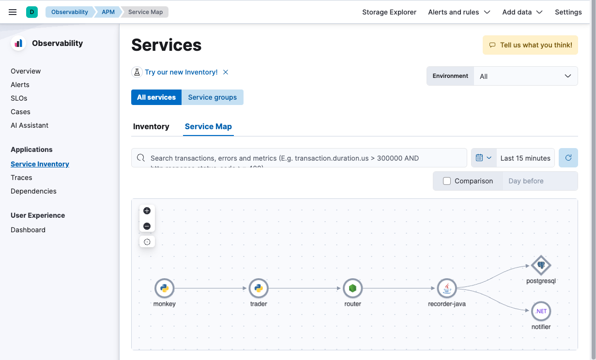

The advent of OpenTelemetry has forever changed how we capture observability signals. While OTel initially focused on delivering traces and metrics, logging support is now stable and gaining adoption.

Notably, OpenTelemetry generally advocates for edge vs. centralized log parsing. Conceptually, pushing log parsing as close to the edge should ultimately make the parsing more robust; as you make changes to the edges of your network (e.g., upgrading an application version), you can, in lock step, update applicable log parsing rules.

To that spirit, this lab explores 3 models for using OpenTelemetry to collect log signals. Within each model, we explore various options for parsing log messages.

1) Service to Collector via OTLP

In this model, we forgo log files entirely, routing log messages directly via the network (OTLP) from service to Collector.

2) Service to Collector via otlpjson log files

In this model, we output logs from select services to a log file written in `otlpjson` format. This makes it trivial to import into a Collector.

3) Service to Collector via free-format log files

In this model, we output logs from select services to a log file in an arbitrary format. This model requires the most manipulation.

Getting Our Bearings
===

To help us better appreciate how OpenTelemetry is forever changing observability, we will be working with an example stock trading system, comprised of several services and their dependencies, all instrumented using [OpenTelemetry](https://opentelemetry.io).

We will be working with a live Elasticsearch instance, displayed in the browser tab to the left. We are currently looking at Elastic's dynamically generated Service Map. It shows all of the services that comprise our system, and how they interact with one another.

Our trading system is composed of:
* `trader`: a python application that trades stocks on orders from customers
* `router`: a node.js application that routes committed trade records
* `recorder-java`: a Java application that records trades to a PostgreSQL database
* `notifier`: a .NET application that notifies an external system of completed trades

Finally, we have `monkey`, a python application we use for testing our system that makes periodic, automated trade requests on behalf of fictional customers.

> [!NOTE]
> You are welcome to explore each service and our APM solution by clicking on each service icon in the Service Map and selecting `Service Details`

When you are ready, click the `Next` button to continue.
