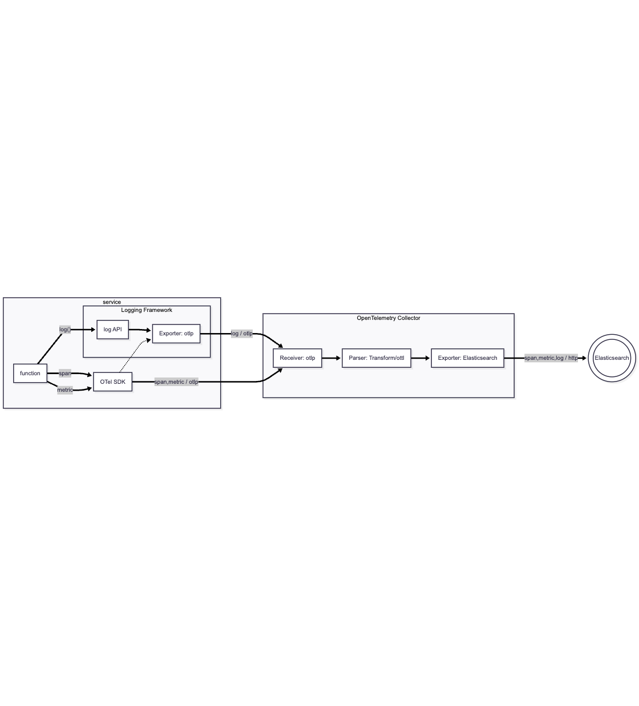

In this model, we will be sending logs directly from a service to an OpenTelemetry Collector via the network using the OTLP protocol. This is typically the most straightforward way to accommodate logging with OpenTelemetry.



Looking at the diagram:
1) A service leverages an existing logging frameworks (e.g., logback in Java) to generate log statements
2) On startup, the OTel SDK injects a new output module into the logging framework. This module formats the log metadata to appropriate OTel semantic conventions (e.g., log.level), adds appropriate contextual metadata (e.g., k8s namespace), and outputs the log lines via OTLP (typically buffered) to a Collector
3) a Collector (typically, but not necessarily) on the same node as the service receives the log lines
4) the Collector adds additional metadata and optionally applies parsing via a Transform Processor
5) the Collector then outputs the logs downstream (either directly to Elasticsearch, or more typically through a gateway Collector, and then to Elasticsearch)

While this model is relatively simple to implement, it assumes 2 things:

1) The service can be instrumented with OpenTelemetry (either through runtime zero-configuration instrumentation, or through explicit instrumentation). This essentially rules out use of this method for most "third-party" applications and services.

2) Your OTel pipelines are robust enough to forgo file-based logging. Traditional logging relied on services writing to files, and agents tailing those log files. File-based logging inherently adds a semi-reliable, FIFO, disk-based queue between services and the collector. If there is a downstream failure in the telemetry pipeline (e.g., a failure in the Collector or downstream of the Collector), the file will serve as a temporary, reasonably robust buffer mechanism.

That said, there are inherent advantages to using a network-based logging protocol where possible: namely:
1) not having to deal with file rotation
2) less io overhead (no file operations)
3) the Collector need not be local to the node running the applications (though you would typically want a Collector per node for other reasons)

Additionally, exporting logs from a service using the OTel SDK offers the following benefits:
1) logs are automatically formatted with OTel Semantic Conventions
2) key/values applied to log statements are automatically emitted as attributes
3) traceid and spanid are automatically added
4) contextual metadata (e.g., node name) are automatically emitted as attributes
5) baggage can be automatically applied as attributes

Java
===

1. Open the [button label="VS Code"](tab-1) tab
2. Navigate to src/recorder-java/src/main/resources/logback.xml
3. Note that no Logback appenders are specified (they are automatically injected by the OTel SDK on startup)

1. Open the [button label="Elasticsearch"](tab-1) tab
2. Copy
    ```kql
    service.name: "recorder-java"
    ```
    into the `Filter your data using KQL syntax` search bar toward the top of the Kibana window
3. Click on the refresh icon at the right of the time picker
4. Open up a "trade committed for <customer_id>" record

Say we wanted to add a custom attribute to the log statement. Of course, we could encode it in the log line text itself, but then we might wind up having to parse it out later. Instead, with OTel, we can easily add this as an attribute to the log record.

The SLF4J logging API supports structured logging with KeyValue pairs. The OTel SDK will automatically turn this into attributes.

1. Open the [button label="VS Code"](tab-1) tab
2. Navigate to src/recorder-java/src/main/java/com/example/recorder/TradeRecorder.java
3. Modify the following line:
  ```
  TransactionAspectSupport.currentTransactionStatus();
  ```
  to:
  ```
  TransactionStatus status = TransactionAspectSupport.currentTransactionStatus();
  log.atInfo().addKeyValue(Main.ATTRIBUTE_PREFIX + ".hash_code", status.hashCode()).log("trade committed for " + trade.customerId);
  ```
4. Recompile and deploy the `recorder-java` service. In the VS Code Terminal, enter:
  ```
  ./builddeploy.sh -s recorder-java
  ```

Check Elasticsearch:
1. Open the [button label="Elasticsearch"](tab-1) tab
2. Close current log record
3. Click refresh
4. Open newest log record
5. Note addition of attribute `attributes.com.example.hash_code`

You'll also note attributes like `attributes.com.example.customer_id`. We didn't add that in our logging statement. How did it get there?

1. Open the [button label="VS Code"](tab-1) tab
2. Navigate to src/trader/app.py
3.


1. Open the [button label="VS Code"](tab-1) tab
2. Navigate to src/recorder-java/src/main/java/com/example/recorder/TradeRecorder.java
3. Note the line `log.atInfo().addKeyValue...` that adds the `hash_code` attribute

You can easily add attributes to logs using the primitives provided by your logging framework (here, logback)

Switching back to [button label="Elasticsearch"](tab-1) tab, you'll notice that this log line has other facets like span.id, etc.

You'll also notice that it has high-value custom metadata added, like "customer_id". Switching back to Java, you'll note that these attributes are not applied in the recorder-java service. Where did they come from?

Switching to VS Code, then python, look at app.py. See add to attributes and baggage. Then switch to Elastic. look at service map. follow trace from trader service. see how all logs emit with attributes.

Python
===

talk about flask.

ES|QL. then how to do it with OTTL. need to use OTTL.


Let's look at where we are starting.

FROM logs-* | WHERE service.name == "trader" | GROK message """%{IP:client_address} - - \[%{GREEDYDATA:time}\] \x22%{WORD:method} %{URIPATH:path}(?:%{URIPARAM:param})? %{WORD:protocol_name}/%{NUMBER:protocol_version}\x22 %{NUMBER:status_code} -""" | WHERE status_code IS NOT NULL | STATS status = COUNT(status_code) BY status_code, method, path


1. Open the [button label="Elasticsearch"](tab-1) tab
2. Copy
    ```kql
    service.name: "trader"
    ```
    into the `Filter your data using KQL syntax` search bar toward the top of the Kibana window
3. Click on the refresh icon at the right of the time picker
4. Note that the body includes a timestamp and log level

Ideally, we want timestamps and log level as first class citizens.

1. Open the [button label="VSCode"](tab-2) tab
2. Open `k8s/postgresql.yaml`
3. Add the following annotation under `spec/template/metadata` (should be same level as `labels`):
  ```yaml
        annotations:
        io.opentelemetry.discovery.logs.postgresql/enabled: "true"
        io.opentelemetry.discovery.logs.postgresql/config: |
          operators:
          - type: container
          - type: regex_parser
            on_error: send
            parse_from: body
            regex: '^(?P<timestamp_field>\d{4}-\d{2}-\d{2} \d{2}:\d{2}:\d{2}.\d{3} [A-z]+)\s\[\d{2}\]\s(?P<severity_field>[A-Z]+):\s*(?<msg_field>.*)$'
            timestamp:
              parse_from: attributes.timestamp_field
              on_error: send
              layout_type: strptime
              layout: '%Y-%m-%d %H:%M:%S.%L %Z'
          - type: severity_parser
            parse_from: attributes.severity_field
            on_error: send
            mapping:
              warn:
                - WARNING
                - NOTICE
              error:
                - ERROR
              info:
                - LOG
                - INFO
              debug1:
                - DEBUG1
              debug2:
                - DEBUG2
              debug3:
                - DEBUG3
              debug4:
                - DEBUG4
              debug5:
                - DEBUG5
              fatal:
                - FATAL
                - PANIC
          - type: move
            on_error: send_quiet
            from: attributes.msg_field
            to: body
          - type: remove
            on_error: send_quiet
            field: attributes.timestamp_field
          - type: remove
            on_error: send_quiet
            field: attributes.severity_field
  ```
4. apply our modified deployment yaml:
  ```
  ./install.sh
  ```

Now let's look at our results:
1. Open the [button label="Elasticsearch"](tab-1) tab
2. Copy
    ```kql
    service.name: "postgresql"
    ```
    into the `Filter your data using KQL syntax` search bar toward the top of the Kibana window
3. Click on the refresh icon at the right of the time picker
4. Note that we now have a log level!
5. Open a log message... note that the @timestamp is set correctly, and we've stripped the header from body.text

# Experimenting with SQL Commenter
