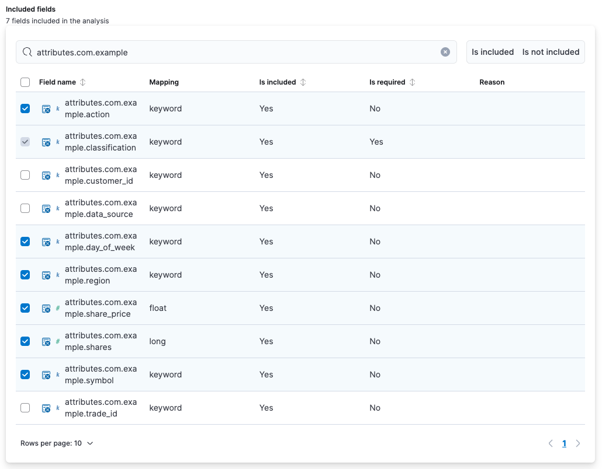
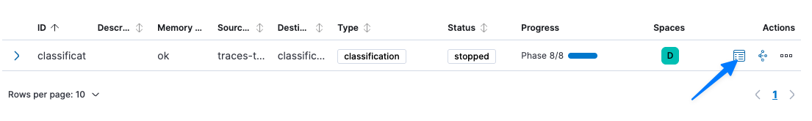

We now have a set of labeled transactions which we can use to train our classification model.

When we train a classification model, we are asking Elasticsearch to model the complex relationship between a dependent variable (`classification`) and influencing variables (e.g., the symbol, the share price, ...). In this example, we include just a handful of influencing variables; in practice, you could have hundreds of such variables.

Model training
===
Remember how your data science team needed months to build a classification model? Let's see how quickly we can do it in Elasticsearch!

1. Select `Create data frame analytics job`
2. Set the `source data view` to `traces-trader`

## 1. Configuration
Under `1. Configuration`, set the following:
1. Select `Classification` as the job type
2. We want to train our model on the training data we just generated, so set the `Query` to
  ```
  attributes.com.example.data_source : "training"
  ```
3. We've classified our training data as `fraudulent` and `unclassified`. We want our model to be able to predict this classification for future trades, so let's tell it which field contains our classification. Set the `Dependent variable` to:
  ```
  attributes.com.example.classification
  ```
4. We now need to tell the model what specific attributes might be useful to predict a pattern of fraudulent activity. First, uncheck all existing `Included Fields` by clicking the checkbox in the upper-left corner twice (first to select all field, second to select no fields)
5. Now let's look specifically at those attributes we manually added to the span. In `Included Fields` > `Search` enter
  ```
  attributes.com.example
  ```
6. Let's train our model to look at the specific fields we think might be good influences in predicting `classification`. Select the following fields:
  * `attributes.com.example.action`
  * `attributes.com.example.classification`
  * `attributes.com.example.day_of_week`
  * `attributes.com.example.region`
  * `attributes.com.example.share_price`
  * `attributes.com.example.shares`
  * `attributes.com.example.symbol`
  (you should have 7 fields included in the analysis)
  
7. Since we've filtered to just the training data we generated, we can set `Training Percent` to `100`
8. Click `Continue`

## 2. Additional options
1. Set `Prediction field name` to
  ```
  classification
  ```
2. Click `Continue`

## 3. Job details
1. Set `Job ID` to
  ```
  classification
  ```
2. Set `Time field for data view` to `@timestamp`
3. Click `Continue`

## 4. Validation
1. Click `Continue`

## 5. Create
1. Click `Create`

Measuring our model's accuracy
===
1. Click on the `Data Frame Analytics` box at the bottom of the `Create Job` page
2. Wait for progress on the `classification` job to read `Phase 8/8`
3. Move to the right-hand side of the `classification` job and click `View`
  
4. Look at `Overall accuracy`; this shows how well the model would have predicted the actual `classification` field

