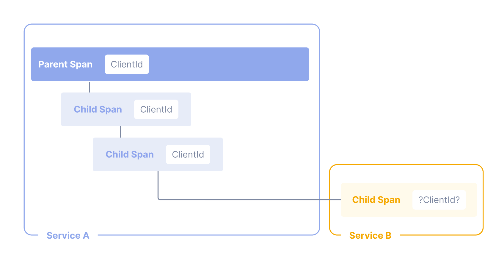

OpenTelemetry Baggage
===

[OpenTelemetry Baggage](https://opentelemetry.io/docs/concepts/signals/baggage/) lets you add arbitrary key/value pairs to contextual "baggage" which is automatically ferried between distributed services on remote API calls (gRPC, REST, ...), alongside a trace and span ID (to establish distributed tracing).



As you might suspect, we can leverage OpenTelemetry Baggage to carry our span attributes between spans and services!

Adding elements to baggage is trivial.

Let's return to the `trader` code:
1. Open the [button label="VS Code"](tab-1) tab
2. Navigate to `src` / `trader` / `app.py`
3. Go back to the python code around line 36 where we previously added the customer_id attribute:
    ```python,nocopy
    customer_id = request.args.get('customer_id', default=None, type=str)
    trace.get_current_span().set_attribute(f"{ATTRIBUTE_PREFIX}.customer_id", customer_id)
    ```
4. Now let's put that attribute we just created in baggage by adding the following line
    ```python
    context.attach(baggage.set_baggage(f"{ATTRIBUTE_PREFIX}.customer_id", customer_id))
    ```
5. You should now have:
    ```python,nocopy
    customer_id = request.args.get('customer_id', default=None, type=str)
    trace.get_current_span().set_attribute(f"{ATTRIBUTE_PREFIX}.customer_id", customer_id)
    context.attach(baggage.set_baggage(f"{ATTRIBUTE_PREFIX}.customer_id", customer_id))
    ```
6. Save the file (Command-S on Mac, Ctrl-S on Windows) or use the VS Code "hamburger" menu and select `File` / `Save`

> [!NOTE]
> OpenTelemetry Baggage key/value pairs are _always_ strings. You will need to keep this in mind if you are trying to propagate an integer attribute, for example. This is particularly important to note if you are manually applying attributes in a parent span as an integer, and then passing that attribute to child spans and services via baggage. If added automatically to child spans, the attribute _must_ have the same type (string) as the manually added attribute in the parent span.

Notably, while this will add this attribute to baggage, that in and of itself won't actually do anything. Baggage is carried from span to span (via thread context) and from service to service (via REST or gRPC). But by default, nothing is actually _done_ with that baggage. We need to tell OpenTelemetry what to do with it.

Propagating Baggage with Extensions
===

Notably, OpenTelemetry Baggage is merely a transport for contextual key/value pairs between spans and services. So how do we get the attributes in baggage to be automatically applied to every child span without having to introduce new code into our applications? Fortunately, OpenTelemetry supports a concept of [extensions](https://opentelemetry.io/docs/zero-code/java/agent/extensions/); namely, loadable modules which can hook into various parts of OpenTelemetry. There already exists an extension (`BaggageSpanProcessor`) for most popular languages which will apply attributes in baggage to the current span.

# Adding the BaggageSpanProcessor to Python

Let's add the BaggageSpanProcessor to our Python trading app:

1. Open the [button label="VS Code"](tab-1) tab
2. Navigate to `src` / `trader` / `app.py`
3. Look for the following code line around the top of `app.py`:
    ```python,nocopy
        tracer = trace.get_tracer(__name__)
    ```
4. Now let's attach the BaggageSpanProcessor to the default tracer provider by inserting the following line before `tracer = trace.get_tracer(__name__)`
    ```python
    trace.get_tracer_provider().add_span_processor(BaggageSpanProcessor(ALLOW_ALL_BAGGAGE_KEYS))
    ```
5. You should now have:
    ```python,nocopy
        trace.get_tracer_provider().add_span_processor(BaggageSpanProcessor(ALLOW_ALL_BAGGAGE_KEYS))
        tracer = trace.get_tracer(__name__)
    ```
6. Save the file (Command-S on Mac, Ctrl-S on Windows) or use the VS Code "hamburger" menu and select `File` / `Save`
7. Enter the following in the terminal pane of VS Code to recompile the `trader` service:
    ```bash
    ./rebuild.sh -s trader
    ```

# Adding the BaggageSpanProcessor to Java

For Java, the BaggageSpanProcessor can be added purely at the orchestration layer:

Get a copy of the latest values.yaml
1. [button label="Elastic"](tab-0)
2. Click `Add data` in lower-left
3. Click `Kubernetes` > `OpenTelemetry (Full Observability)`
4. Copy the URL to the `values.yaml`
```
https://raw.githubusercontent.com/elastic/elastic-agent/refs/tags/v8.17.4/deploy/helm/edot-collector/kube-stack/values.yaml
```
5. Open the [button label="VS Code"](tab-1) tab
6. Create a new file in the folder `operator` with the following contents
    ```yaml
    apiVersion: opentelemetry.io/v1alpha1
    kind: Instrumentation
    metadata:
    name: elastic-instrumentation
    spec:
    java:
        image: docker.elastic.co/observability/elastic-otel-javaagent:1.3.0
        extensions:
        - image: us-central1-docker.pkg.dev/elastic-sa/tbekiares/baggage-processor
            dir: /extensions
        env:
        - name: OTEL_JAVA_SPAN_ATTRIBUTES_COPY_FROM_BAGGAGE_INCLUDE
            value: '*'
    ```
7. Save the file as `operator/java.yaml`
12. Save the file (Command-S on Mac, Ctrl-S on Windows) or use the VS Code "hamburger" menu and select `File` / `Save`
13. Redeploy the operator config by issuing the following:
    ```
    kubectl -n opentelemetry-operator-system apply -f java.yaml
    kubectl -n trading rollout restart deployment/recorder-java
    ```

Let's test
===

1. Open the [button label="Elasticsearch"](tab-1) tab
2. Navigate to `Observability` / `APM` / `Traces`
3. Click on the `Explorer` tab
4. Copy
    ```kql
    attributes.com.example.customer_id : "l.hall"
    ```
    into the `Filter your data using KQL syntax` search bar toward the top of the Kibana window
5. Click `Search`
6. Click on the child spans inside `trader`; note in the flyout for each that the `attributes.com.example.customer_id` exists
7. Scroll down and click on the failed `SELECT trades.trades` span
8. Note that our label is _also_ applied to the SQL spans

As you've seen, OpenTelemetry Baggage, with the help of OpenTelemetry Extensions, makes it possible to add contextual attributes across spans and services:
* _without_ requiring explicit code to add attributes to child functions
* _without_ requiring explicit code to transfer attributes between services