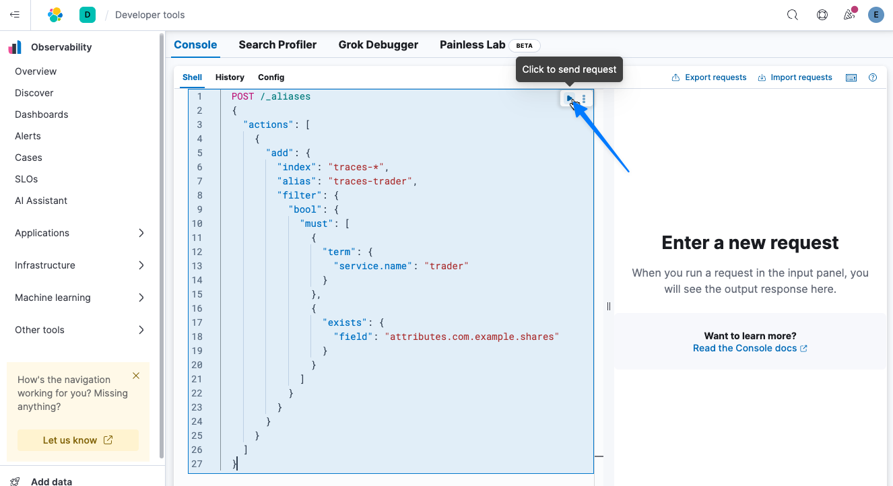

We know there has been a rash of fraudulent transactions. Our customer service team has been diligently labelling those transactions as fraudulent as they are reported. Unfortunately, we don't know why those transactions are fraudulent; there are simply too many variables for a human to track and follow. This is, of course, an ideal application of a classification machine learning model: determining complex relationships between many variables.

To build our supervised classification model, we will need a set of transactions we know to be fraudulent.

Setup Data Views
===
First, let's create a custom Index Alias in Elasticsearch which dynamically filters all of our APM trace data to look at _just_ the traces which represent trades.

1. In Elastic, Copy and paste the following into the left-hand pane of `Developer Tools`
  ```
    POST /_aliases
    {
      "actions": [
        {
          "add": {
            "index": "traces-*",
            "alias": "traces-trader",
            "filter": {
              "bool": {
                "must": [
                  {
                    "term": {
                      "service.name": "trader"
                    }
                  },
                  {
                    "exists": {
                      "field": "attributes.com.example.shares"
                    }
                  }
                ]
              }
            }
          }
        }
      ]
    }
  ```
2. Execute the `POST` command by clicking on the triangle on the right-hand side of the first line of the command
   
3. Confirm the response
  ```nocopy
  {
    "acknowledged": true,
    "errors": false
  }
  ```
4. Copy and paste the following into the left-hand pane of Elasticsearch `Developer Tools`:
  ```
  POST kbn:/api/data_views/data_view
  {
    "data_view": {
      "name":"traces-trader",
      "title":"traces-trader",
      "timeFieldName":"@timestamp"
    }
  }
  ```
5. Execute the `POST` command by clicking on the triangle on the right-hand side of the first line of the command
6. The response should indicate that a Data View was created

Let's test our Index Alias in Discover and ensure it filters for _just_ the traces which represent trades:
1. Navigate to the [button label="Elastic"](tab-0) tab
2. Use the navigation pane to navigate to `Discover` and then select the `Discover` tab (and not `Logs Explorer`)
3. Click `Try ES|QL`
4. Enter the following ES|QL:
  ```
  FROM traces-trader |
  LIMIT 100 |
  KEEP attributes.com.example.trade_id, attributes.com.example.action, attributes.com.example.day_of_week, attributes.com.example.region, attributes.com.example.share_price, attributes.com.example.shares, attributes.com.example.symbol
  ```

Obtaining training data
===
We will need a dataset of already classified transactions to train our model. Typically, this would come via your customer service team marking existing transactions as fraudulent as they are reported.

For our purposes, rather than include canned data already marked as fraudulent, we will put you in the mind of the criminal! You will be making a whole bunch of (secret) fraudulent transactions that we will presume our our customer service department labels as they are reported by customers. The goal will be to see if the classification model you train with Elastic can find a pattern in your fraudulent trades.

> [!NOTE]
> Criminals (at least smart ones), of course, don't intentionally follow a pattern. But they likely would _unintentionally_ practice one. For example, perhaps their schedule unintentionally dictates that they make their transactions on Mondays and Wednesdays. Or perhaps trading only certain stocks is financially advantageous to them? Remember, their prime directive is to make money and not necessarily to avoid getting caught.

Let's put on our black hats and get to work!
1. Click on the [button label="Trader"](tab-1) tab
2. Click `Classification`
3. Decide what pattern your fraudulent transactions will follow. Maybe you only trade on certain days of the week or from certain regions? Or you only trade a certain number of certain stocks at certain prices? Come up with any combination you'd like! Leave `Classification` and `Data Source` fields as defaults, and be careful not to make your transactions _too_ specific or wide (e.g., don't limit trading to between just 5-10 shares of one stock, or leaving everything as default).
4. Click `SUBMIT`
5. Wait for the spinner to stop; this indicates that training data generation is complete (this could take a minute or two)

While you are waiting for the training data to be generated, consider taking a screen snapshot of your training configuration or writing down the parameters. You will need to reference this later to check how well our model is predicting potential fraud in new transactions.

> [!NOTE]
> But wait... didn't we just "tell" Elastic our pattern for fraudulent transactions? Nope. We just made a bunch of fraudulent transactions as a criminal. The pattern of fraudulent transactions is known only to you, the criminal. From the perspective of Elastic and the trading company, all we know is that a bunch of recent transactions have been reported by customers as fraudulent.

Validate training data
===
Before we train our model, let's quickly check that the training data we just generated looks as expected. We can easily do this using [ES|QL](https://www.elastic.co/docs/explore-analyze/query-filter/languages/esql), Elastic's powerful piped query language.
1. Navigate to the [button label="Elastic"](tab-0) tab
2. Use the navigation pane to navigate to `Discover` and then select the `Discover` tab (and not `Logs Explorer`)
3. Click `Try ES|QL`
4. Enter the following ES|QL:
  ```
  FROM traces-trader |
  WHERE attributes.com.example.data_source == "training" AND attributes.com.example.classification == "fraud" |
  LIMIT 100 |
  KEEP attributes.com.example.trade_id, attributes.com.example.action, attributes.com.example.day_of_week, attributes.com.example.region, attributes.com.example.share_price, attributes.com.example.shares, attributes.com.example.symbol
  ```
5. Verify that the fraudulent training data we generated was recorded and labeled as expected.
