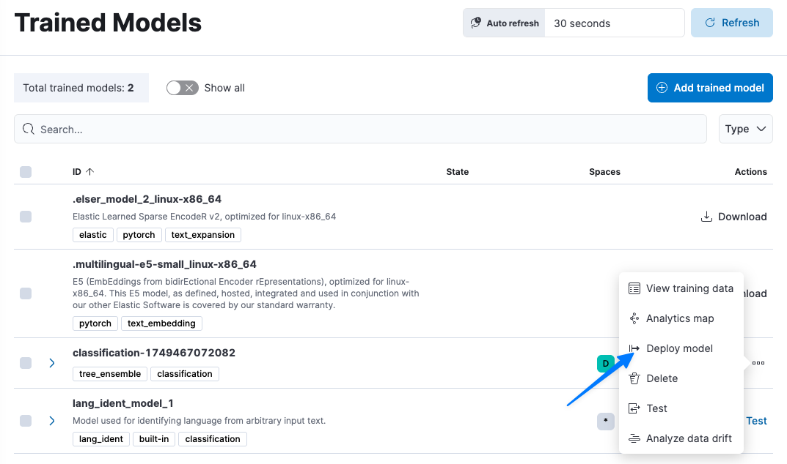

Now that we've built a model, we can deploy and apply it against simulated trades being generated by our `monkey` service to see if it can identify and label trades as possibly fraudulent.

To apply the model we just trained, we will be creating an Ingest Pipeline. That Ingest Pipeline could then be applied in real-time to new trades transactions, or can be applied to batches of transaction data. Given the CPU overhead associated with running a model, typically you would run the model in a batch, non-realtime manner.

# Create an Ingest Pipeline
1. On our Trained Models page, find the model `classifcation-*`
2. On the right hand side of row containing our model, click `...` to open the contextual menu and select `Deploy model`
  
3. Under `1. Details` select `Continue`
4. Under `2. Configure processor` select `Continue`
5. Under `3. Handle failures` select `Continue`
6. Under `4. Test (Optional)` select `Continue`
7. Under `5. Create` select `Create pipeline`

## Next steps
Now we will apply that ingest pipeline to all of the trade transactions to date.

Open `Next steps`:
1. Open `Reindex with pipeline`
2. Set `Destination index name` to
  ```
  classified_trades
  ```
3. Enable `Create data view`
  
4. Click `Reindex`
5. Click 'Close'

Checking our accuracy
===
Once the re-indexing (batch) operation is complete, we can have a look at the results.

# Discover
Let's first spot check things in Discover to ensure at least some transactions were labeled as fraudulent.
1. In Elastic, use the navigation pane to navigate to `Discover` and then select the `Discover` tab (and not `Logs Explorer`)
2. Set `Data view` to `classified_trades` (this is the index where we asked Elasticsearch to store the results after applying the model)
3. We want to look specifically at _non-training_ data which was labeled as fraudulent. To do that, set the `Filter` to
  ```
  attributes.com.example.data_source : "monkey" and ml.inference.classification.classification :"fraud"
  ```
4. Open a row and note that the attributes match the pattern of fraudulent transactions you previously generated (refer to that screen snapshot you took)

# Custom Dashboard
Now that's we've confirmed we are labeling transactions as fraudulent, let's visualize and validate our results!

We've created a custom dashboard which we can use to visually compare the classification of transactions against the features of the transactions.

1. In Elastic, navigate to `Dashboards` > `Fraudulent Transactions`
2. Validate that graphs match the pattern of fraudulent transactions you generated (refer to that screen snapshot you took)

> [!NOTE]
> This dashboard is filtering out training data. You are looking solely at the transactions made by our `monkey` service.

For example, if, as a criminal, you traded only on Mondays and Wednesdays, you should see transactions that `monkey` made on Mondays and Wednesdays as being partially fraudulent.

Summary
===

In less than an hour we were able to build, deploy, and validate a model which can successful predict fraudulent transactions. We built our model from actual fraudulent data (which you generated), classified as fraudulent (by our customer service team). We let Elastic do the heavy lifting of studying the complex relationship between the influencing variables to build a practical and fairly accurate model. All without requiring months of work by your data science team.

Want to learn more about Elastic's support for OpenTelemetry or our out-of-the-box Machine Learning? [Reach out to us!](https://www.elastic.co/contact)